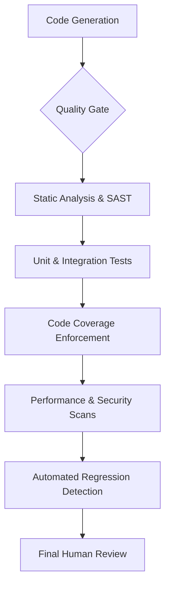
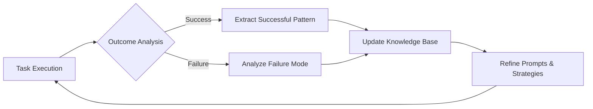
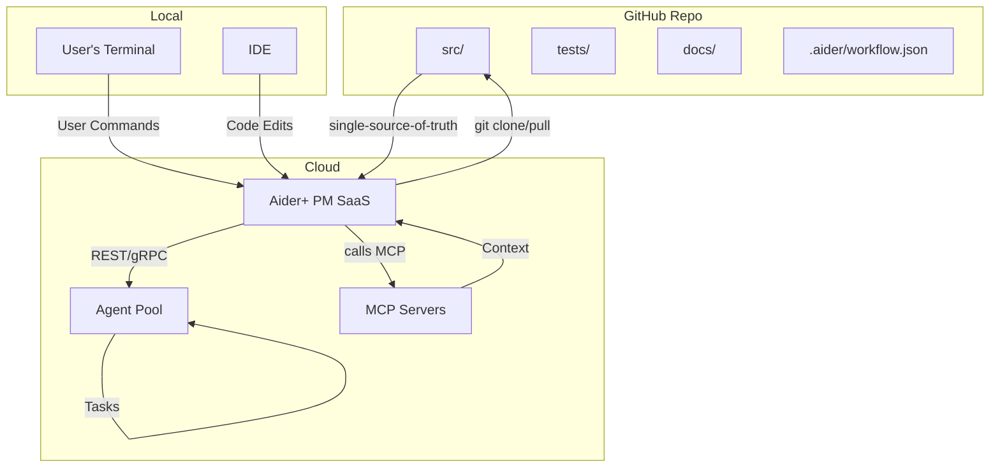

# Aider+ Design Document

## Executive Summary

This document outlines the design for Aider+, a next-generation AI development assistant that functions as an autonomous AI Project Manager (PM). Aider+ is designed to orchestrate a team of specialized AI "engineers" (LLMs) to manage the entire software development lifecycle, from high-level goal decomposition to implementation, testing, and deployment. The core vision is to elevate the human user to the role of a Senior Engineer or Architect, who provides strategic direction and final approval, while Aider+ handles the tactical execution.

Key architectural pillars include a robust state management system with git-based rollbacks, an intelligent task scheduler that optimizes for cost and speed, and a sophisticated agent orchestration framework. The workflow is structured around a multi-stage quality assurance pipeline, incorporating not just Test-Driven Development (TDD), but also static analysis, security scanning, and automated regression detection. To maximize throughput, Aider+ will employ advanced strategies like speculative execution and adaptive task batching.

User experience is enhanced through interactive plan refinement, a rich status dashboard, and proactive conversational clarification. The system is designed for continuous improvement via a feedback loop that refines prompts and processes based on task outcomes. This document details the phased implementation strategy, operational considerations including disaster recovery, and the long-term vision for creating a truly autonomous, self-improving development platform.

<details>
<summary><strong>Table of Contents</strong></summary>

- [1. Vision & Goals: Aider+ as the AI Project Manager](#1-vision--goals-aider-as-the-ai-project-manager)
- [1.5. Quick Start Guide](#15-quick-start-guide)
- [2. Key Features: The AI Project Manager's Toolkit](#2-key-features-the-ai-project-managers-toolkit)
- [3. Proposed Architecture: The Aider+ PM System](#3-proposed-architecture-the-aider-pm-system)
- [4. Example End-to-End Flow: A Day in the Life of the Aider+ PM](#4-example-end-to-end-flow-a-day-in-the-life-of-the-aider-pm)
- [5. Operational Considerations: From Blueprint to Reality](#5-operational-considerations-from-blueprint-to-reality)
- [6. Incremental Adoption Strategy: Building Aider+ in Phases](#6-incremental-adoption-strategy-building-aider-in-phases)
- [7. Advanced Mechanisms for Quality, Throughput, and Robustness](#7-advanced-mechanisms-for-quality-throughput-and-robustness)
- [8. Long-Term Evolution and Ecosystem Integration](#8-long-term-evolution-and-ecosystem-integration)
- [9. The Traceability & Reconciliation Framework: Ensuring Cohesion](#9-the-traceability--reconciliation-framework-ensuring-cohesion)
- [10. Observability, Metrics & Continuous Improvement](#10-observability-metrics--continuous-improvement)
- [11. Security, Privacy & Compliance Guardrails](#11-security-privacy--compliance-guardrails)
- [12. Plugin & Extension API](#12-plugin--extension-api)
- [13. Runtime Architecture & Deployment Strategies](#13-runtime-architecture--deployment-strategies)
- [14. FAQ](#14-faq)
- [15. Repository and Codebase Strategy: Monorepo Approach](#15-repository-and-codebase-strategy-monorepo-approach)
- [16. Detailed Implementation Plan](#16-detailed-implementation-plan)
- [Glossary](#glossary)

</details>

## 1. Vision & Goals: Aider+ as the AI Project Manager

This document outlines the design for Aider+, an advanced AI assistant that reframes the development process. We conceptualize the system using the following metaphor:

*   **The Human User as the Senior Engineer/Architect:** You provide high-level direction, strategic guidance, and final approval. Your expertise is reserved for critical decisions, not routine implementation.
*   **Aider+ as the AI Project Manager (PM):** Aider+ is the core orchestrator. It is a non-coding manager responsible for taking your high-level goals, breaking them down into concrete tasks, managing the engineering team, ensuring quality, and reporting progress.
*   **LLMs as the AI Engineering Team:** A pool of specialized "junior engineers" (different LLMs or configured models) who execute the tasks assigned by the Aider+ PM. They write code, create tests, draft documentation, and perform research, each according to their specialty.

The primary goal of Aider+ is to **maximize the autonomous productivity of the AI Engineering Team**, thereby minimizing the required hands-on time from the Senior Engineer. It achieves this by managing the entire development lifecycle, from initial design to final implementation, based on structured, repeatable workflows.

## 1.5. Quick Start Guide

This section provides a brief overview of how a user would interact with the Aider+ system.

1.  **Initiate a High-Level Goal:** The user starts by giving Aider+ a high-level objective using the `/plan` command.
    ```bash
    /plan Implement OAuth 2.0 login with Google
    ```
2.  **Review and Refine the Plan:** Aider+ analyzes the goal and presents a multi-step implementation plan. The user can approve it, request changes, or interactively refine it.
    ```
    PM: Here's my plan for implementing OAuth:
    1. Add dependencies ⚠️ [Suggestion: also add refresh token support]
    2. Create auth middleware
    3. Add login endpoint ⚠️ [Missing: logout endpoint]
    4. Write tests

    Your action? [/approve | /refine | /modify]
    ```
3.  **Monitor Autonomous Execution:** Once approved, Aider+ manages the AI engineering team to execute the plan. The user can monitor progress via a rich status dashboard showing a Gantt chart of tasks, agent utilization, and cost burn rate.
    ```bash
    /status
    ```
4.  **Provide Feedback and Final Approval:** Aider+ presents completed work, having already passed an internal multi-stage review pipeline (linting, tests, security scans). The user gives the final approval for the commit.
    ```bash
    /approve
    ```

## 2. Key Features: The AI Project Manager's Toolkit

This section outlines the capabilities of Aider+ through the lens of its role as an AI Project Manager. Each feature is a tool the PM uses to manage the AI Engineering Team and deliver high-quality software.

### 2.1. Model Context Protocol (MCP) Integration: The Research & Tooling Department

MCP integration provides the AI Engineering Team with the tools and information necessary to perform their tasks. The Aider+ PM directs the use of these tools.

*   **Knowledge Retrieval:**
    *   **Online Documentation:** When an engineer (LLM) encounters an unfamiliar API or concept, the PM can authorize a web search to retrieve documentation.
    *   **Cross-Repository Code:** To ensure consistency and learn from existing patterns, the PM can grant access to other configured codebases, allowing engineers to `/lookup` symbols and implementation details.

### 2.2. Agentic Workflow: The Project Management Engine

This is the core of Aider+. It's the system the PM uses to plan, execute, and monitor complex development tasks from start to finish.

*   **Autonomous Task Execution:** The PM takes a high-level goal from the Senior Engineer and manages the entire development lifecycle for that task.
*   **State Management & Persistence:** The PM maintains a `workflow.json` file in the `.aider` directory, tracking the current plan, progress, and history. This allows the entire project to be paused and resumed.
*   **Intelligent Context Management:** The PM is responsible for providing each engineer with the precise context they need, without exceeding token limits. This includes:
    *   **Proactive File Management:** Automatically adding relevant files to the chat.
    *   **Semantic Code Analysis:** Using code analysis to automatically identify related files and dependencies beyond simple text search or import statements.
    *   **Repo-Wide Search:** Searching the entire codebase for relevant snippets.
    *   **Context Condensation:** Summarizing or "cropping" large files to their essential parts.
    *   **Context Decay:** Gradually removing older, unreferenced context from the window to make room for more relevant information.
    *   **Internal Scratchpad:** Using a `scratchpad.md` to take notes, draft plans, and formulate complex solutions before assigning them.

*   **Asynchronous Operations:** The PM can manage long-running tasks (like a full test suite run) in the background, allowing the Senior Engineer and other agents to continue working without being blocked.

### 2.3. Structured Development Workflow: The PM's Playbook

The PM follows a structured, predictable playbook for all development tasks, ensuring consistency and quality. This workflow is inspired by the successful patterns observed in the session transcripts.

*   **Workflow Stages:**
    1.  **Architect/Design:** The PM first directs an agent to create a design document for any non-trivial task.
    2.  **Expand/Plan:** Once the design is approved by the Senior Engineer, the PM breaks it into a detailed, step-by-step implementation plan with clear tasks.
    3.  **Implement (TDD Cycle):** The PM assigns tasks to the appropriate engineers, enforcing a TDD cycle:
        a.  An engineer writes a failing test.
        b.  An engineer writes the code to make the test pass.
        c.  The code is refactored for quality.
    4.  **Review/Critique/Refine:** At each stage, the PM facilitates a review process.

*   **The Refinement & Critique Loop:**
    *   **Automated Self-Critique:** Before any code is submitted for human review, the PM initiates an internal code review. It assigns the code to a "reviewer" agent (which can be a different, more critical LLM) with a comprehensive prompt covering correctness, testing, style, performance, security, and reliability. This internal loop polishes the work, reducing the burden on the Senior Engineer.
    *   **Senior Engineer Review:** After the internal critique, the PM presents the polished work to the human user for final approval. The user can `/approve`, `/request_changes`, or ask for clarification. The PM manages this feedback loop until the user is satisfied.

### 2.4. Team Management: Orchestrating the AI Engineering Team

Aider+ doesn't just use one LLM; it manages a team of specialized AI engineers.

*   **Specialized Roles:** The PM can be configured to use different models for different roles:
    *   **Code Generator:** A model optimized for writing idiomatic and correct code.
    *   **Test Engineer:** A model that excels at writing thorough and effective tests.
    *   **Code Reviewer/Analyst:** A model with strong critical thinking skills to find bugs and suggest improvements.
    *   **Technical Writer:** A model skilled at generating clear documentation.
*   **Task Assignment:** The PM assigns tasks from its plan to the most appropriate engineer based on their specialty.
*   **Parallel Execution:** The PM can identify independent tasks in the plan and assign multiple engineers to work on them in parallel, significantly speeding up development.

## 3. Proposed Architecture: The Aider+ PM System

The architecture is designed to support the AI Project Manager metaphor, focusing on robustness, scalability, and intelligence.

### 3.1. Core Components

*   **`AiderPlusPM` (The Project Manager):** The central class that orchestrates the entire workflow. It manages the project plan, state, and task assignments.
*   **`AIEngineeringTeam` (The Team):** A manager class that holds references to the various configured LLMs (engineers). It exposes methods like `coder()`, `reviewer()`, `tester()` to the PM for easy task delegation.
*   **`KnowledgeRetriever` (The Research Department):** A module responsible for all external information gathering via MCP, including web search and cross-repo code lookups.
*   **`Task` (The Unit of Work):** A data class representing a single, actionable step in the plan (e.g., "write a test for `User.name`").
*   **`WorkflowState` (The Project Plan):** A persistent data structure, likely stored in `.aider/workflow.json`, that saves the entire plan, the status of each task, and the history of actions, allowing sessions to be resumed.

### 3.2. Enhanced State Management & Recovery
*   **Git-Based Checkpoints:** Beyond `workflow.json`, the PM will use `git stash` or temporary branches to create atomic checkpoints before attempting risky tasks. This allows for a true rollback to a known-good code state if a task fails irrecoverably.
*   **Distributed State:** For multi-instance deployments, workflow state can be managed in a distributed store like Redis or etcd to ensure consistency and enable seamless failover.

### 3.3. Intelligent Task Scheduling
*   **Dynamic Priority Adjustment:** The scheduler will adjust task priorities based on real-time factors like critical path analysis, historical success rates, and current agent availability.
*   **Predictive Duration:** The system will use historical data to estimate task completion times, providing better forecasts to the user.
*   **Task Preemption:** High-priority tasks (e.g., a user's `/intervene` command) can preempt lower-priority tasks, which are safely paused and resumed later.

### 3.4. Advanced Agent Orchestration & Configuration
The PM will manage agent pools and route tasks intelligently based on patterns.

*   **Configuration (`.aider.conf.yml`):**
    ```yaml
    aider_plus:
      team:
        pools:
          critical:
            - model: claude-3.5-sonnet
              max_concurrent: 2
          standard:
            - model: gpt-4o
              max_concurrent: 5
          economy:
            - model: o3-mini
              max_concurrent: 10
        routing:
          - pattern: "security|auth|crypto"
            pool: critical
          - pattern: "test|spec"
            pool: standard
          - pattern: "doc|comment|format"
            pool: economy
        default_pool: standard
      mcp_repositories:
        - /path/to/other/repo1
      search_api: brave
      search_api_key: your_key_goes_here
      cost_management:
        budget_usd: 5.00 # Per /plan workflow
      agentic_workflow:
        max_retries_per_task: 3
    ```

## 4. Example End-to-End Flow: A Day in the Life of the Aider+ PM

**Scenario:** The Senior Engineer wants to add SAML certificate validation.

1.  **Senior Engineer:** `/plan add sp cert validation support to our SAML integration`

2.  **Aider+ PM:** "Acknowledged. I will assign a junior engineer to analyze the current SAML implementation and propose a design."
    *   *(The PM assigns the task to its default agent, which reads relevant files like `omniauth_callbacks_controller.rb` and `devise.rb`.)*

3.  **Aider+ PM (presenting agent's work):** "The initial analysis is complete. The proposed design involves adding `sp_cert` and `sp_private_key` to the Devise configuration. Please review the design document `docs/saml_sp_cert_validation.md`."

4.  **Senior Engineer:** `/request_changes "Actually, can you make the signature settings configurable (default false), and allow the cert and private key env vars to be null in the default case?"`

5.  **Aider+ PM:** "Understood. I've updated the design document and the implementation plan to reflect these new requirements. The plan now consists of 4 tasks. Please review and approve."
    *   *(PM displays an interactive plan):*
        ```
        PM: Here is the updated plan:
        1. Add new config to `devise.rb` ⚠️ [Suggestion: Add validation for key format]
        2. Update controller to use new config
        3. Add test for `enabled: false` case
        4. Add test for `enabled: true` case

        Your action? [/approve | /refine "Incorporate suggestion" | /modify]
        ```

6.  **Senior Engineer:** `/approve`

7.  **Aider+ PM:** "Plan approved. I am assigning the implementation tasks to the engineering team. This can be done in parallel."
    *   *(PM assigns tasks to two available coder/tester pairs.)*
    *   **Agent 1:**
        1.  `[Test Engineer]` writes failing test for `enabled: false`.
        2.  `[Code Generator]` writes code to pass the test.
        3.  `[Code Reviewer]` performs automated self-critique, finds a minor style issue, which is fixed.
    *   **Agent 2:**
        1.  `[Test Engineer]` writes failing test for `enabled: true`.
        2.  `[Code Generator]` writes code but it has a bug.
        3.  `[Test Engineer]` runs the test, which fails. The agent analyzes the error.
        4.  `[Code Generator]` fixes the bug. The test now passes.
        5.  `[Code Reviewer]` performs self-critique.

8.  **Aider+ PM:** "All implementation tasks are complete and have passed internal review and testing. The changes are ready for your final approval."
    *   *(The PM presents the final diff.)*

9.  **Senior Engineer:** `Looks good. /approve`

10. **Aider+ PM:** "Approved. Committing changes and finalizing documentation."
    *   *(The PM commits the code with a sensible message and assigns the `writer` agent to update the main README if necessary.)*

## 5. Operational Considerations: From Blueprint to Reality

To ensure Aider+ is not just powerful but also practical, reliable, and controllable, we must consider its operational characteristics.

### 5.1. User Interaction & Control

The Senior Engineer needs clear and powerful controls to direct the Aider+ PM.

*   **Core Commands:**
    *   `/plan <goal>`: Initiates a new high-level task.
    *   `/approve [task_id|all]`: Approves a proposed design, plan, or final implementation.
    *   `/request_changes <feedback>`: Rejects a proposal and provides feedback for revision.
    *   `/status`: Reports on the current plan, task status, and any active agents.
    *   `/cancel [task_id|all]`: Halts an ongoing task or the entire workflow.
    *   `/intervene`: Pauses the PM and allows the Senior Engineer to make manual code edits or provide direct instructions to a specific agent.

*   **Rich Status Dashboard:** The `/status` command will provide a link to a real-time web dashboard (or render a rich terminal UI) showing:
    *   A Gantt chart of the project plan with active tasks highlighted.
    *   Agent utilization metrics and current assignments.
    *   A cost burn-down chart against the session budget.
    *   Predicted completion times with confidence intervals.

*   **Conversational Clarification:** When the PM detects ambiguity, it will proactively ask for clarification with structured choices.
    ```
    PM: I need clarification on "add caching":
    1. Use Redis for distributed caching?
    2. Use in-memory for single-instance?
    3. Implement a cache-aside pattern?
    4. Implement a write-through pattern?
    [Select one or more, or type a custom response]
    ```

### 5.2. Error Handling & Recovery: The PM's Contingency Plan

Complex software development is rarely a straight line. The PM must be equipped to handle setbacks.

*   **Stuck Agent Detection:** The PM will monitor agent progress. If an agent fails to make progress on a task after a configurable number of attempts (e.g., a test repeatedly fails with the same error), the PM will pause the task.
*   **Escalation Protocol:** When a task is paused, the PM will escalate the issue to the Senior Engineer. The escalation report will include:
    *   The task description.
    *   A summary of attempts made.
    *   The final error message or failing test output.
    *   A recommendation (e.g., "Suggest assigning to a different agent," "Suggest revising the plan," or "Requesting manual intervention").
*   **State Checkpointing:** The `workflow.json` serves as a durable checkpoint. If the system crashes, it can be resumed from the last known good state, preserving the plan and completed work.

### 5.3. Cost Management & Oversight

The use of multiple, powerful LLMs necessitates robust cost control.

*   **Model Tiering:** The configuration allows for "task-to-model" mapping via agent pools and routing rules. Simple tasks are assigned to cheaper models, while complex tasks are reserved for top-tier models.
*   **Budgetary Controls:** The user can set session-based or project-based cost limits. The PM tracks estimated token usage and warns the user when they are approaching the limit, pausing new tasks until the user confirms.
*   **Transparent Reporting:** The `/status` command and dashboard include a running total of the session's estimated cost.

### 5.4. Disaster Recovery
*   **Backup Strategies:** The `.aider/` directory, including `workflow.json` and the project knowledge base, should be regularly backed up. Since it's part of a git repository, remote pushes serve as a natural backup mechanism.
*   **Rollback Procedures:** In case of catastrophic failure, the system can be rolled back to the last git commit and the `workflow.json` can be manually reconciled or reset for the failed plan.
*   **Business Continuity:** For hosted or team versions of Aider+, a high-availability architecture for the PM service and state store (e.g., replicated Redis) would be required.

## 6. Incremental Adoption Strategy: Building Aider+ in Phases

This ambitious vision can be delivered incrementally, providing value at each stage.

### 6.1. Phase 1: The Structured Co-pilot

*   **Focus:** Implement the "Structured Development Workflow" for a *single* agent.
*   **Features:**
    *   The user provides a goal.
    *   Aider+ creates a design, then a plan.
    *   The user approves the plan.
    *   The agent executes the plan step-by-step, following the TDD cycle.
    *   The agent uses the self-critique loop to refine its work.
*   **Value:** This phase moves beyond simple request-response and introduces a structured, repeatable process for complex tasks, improving reliability even without a "team" of agents.

### 6.2. Phase 2: The Project Lead

*   **Focus:** Introduce the `AIEngineeringTeam` and `Team Management` concepts.
*   **Features:**
    *   Configure different models for different roles (coder, tester, reviewer).
    *   The PM now assigns tasks from the plan to the appropriate specialized agent.
    *   Implementation of the `KnowledgeRetriever` to provide external context.
*   **Value:** Specialization improves the quality of the output. The PM begins to function as a true orchestrator, delegating tasks effectively.

### 6.3. Phase 3: The Autonomous Project Manager

*   **Focus:** Enable true autonomy and parallelism.
*   **Features:**
    *   Implement parallel execution of independent tasks.
    *   Develop the more advanced agentic capabilities: proactive context management, asynchronous operations, and robust error handling/escalation.
*   **Value:** This phase realizes the full vision of Aider+, maximizing AI productivity and minimizing the need for constant human supervision.

### 6.4. Implementation Prioritization
To deliver value quickly, the initial focus should be on the most impactful features.
1.  **Phase 0.5 (Pre-Phase 1):** Build robust state management and recovery (`workflow.json`, git-based checkpoints). This is the foundation for all agentic work.
2.  **Phase 1:** As described above.
3.  **Phase 1.5:** Add intelligent context management (semantic analysis, batching) to make Phase 1 more powerful.
4.  **Phase 2:** As described above.
5.  **Phase 2.5:** Implement the continuous learning loop and advanced verification techniques to improve quality.
6.  **Phase 3:** As described above.

## 7. Advanced Mechanisms for Quality, Throughput, and Robustness

To elevate Aider+ from a capable assistant to a world-class project manager, we can incorporate advanced mechanisms that target specific operational goals.

### 7.1. Advanced Quality Assurance: The Multi-Stage Quality Gate

Beyond the self-critique loop, the PM enforces a formal, multi-stage "Quality Gate" that all code must pass before being presented to the Senior Engineer. This automates best practices that human teams follow.



*   **Static Analysis & SAST:** Before running any tests, the PM will run a configurable suite of static analysis tools (e.g., linters, Semgrep). Violations are automatically assigned back to a `coder` agent for fixing.
*   **Code Coverage Enforcement:** The PM can be configured with a required code coverage percentage. If new code doesn't meet the threshold, the PM tasks the `tester` to add more tests.
*   **Performance & Security Scanning:** For sensitive tasks, the PM can trigger automated scans. Regressions or vulnerabilities must be addressed.
*   **Automated Regression Detection:** Before committing, the PM runs a diff analysis against test coverage and can use mutation testing (e.g., `mutmut`) to verify the quality and completeness of tests for the changed code paths.

#### 7.1.1. AI-Powered Advanced Testing & Verification

The "Quality Gate" can be extended with sophisticated verification techniques that were traditionally expensive to implement.

*   **Probabilistic Verification (Dual Implementation):** A high-confidence technique where the PM assigns the same functional specification to two *independent* `coder` agents (ideally backed by different LLMs). A third agent then writes a test suite that fuzzes both implementations with the same inputs and asserts that their outputs are identical. If confidence is low, it escalates.
    ```python
    results = await parallel_execute([
        agent_pool.get("claude").implement(task),
        agent_pool.get("gpt4o").implement(task)
    ])
    confidence = analyze_consensus(results)
    if confidence < 0.8:
        escalate_to_human("Low confidence in implementation consensus.")
    ```
*   **Property-Based Testing:** The PM instructs a `tester` agent to define general properties the code must satisfy (e.g., "output is always between 0 and original price"). A library like Hypothesis then generates hundreds of inputs to try and falsify these properties.
*   **AI-Guided Fuzz Testing:** The PM deploys an agent to generate random and malformed inputs to an API endpoint or function to uncover security vulnerabilities and crashes.
*   **Invariant & Assertion Generation:** A `reviewer` agent analyzes code and automatically injects assertions to verify critical assumptions at runtime, especially during testing.
*   **Simplified Formal Methods:** For critical logic like a state machine, an `analyst` agent can translate it into a simplified formal specification (e.g., TLA+) and use a model checker to test for deadlocks or race conditions.

#### 7.1.2. Meta-Verification: Using LLMs to Counteract LLM Weaknesses

The Aider+ PM can employ strategies that use the creative strengths of LLMs to guard against their weaknesses, such as hallucination or subtle logical errors.

*   **Adversarial "Red Team" Testing:** After a feature is complete, a separate `red_team` agent is assigned the single goal: "break this code." This agent thinks adversarially to find security flaws and edge cases the original `tester` might have missed.
*   **Explanation-Based Verification:** An `auditor` agent reads the final code and is tasked to "explain this code's purpose and logic in plain English." This explanation is compared against the original design specification to find deviations.
*   **Hypothesis-Driven Debugging:** When a test fails, a `debugging` agent first generates multiple hypotheses for the root cause. It then devises and runs a minimal experiment (e.g., a new targeted test) to validate each hypothesis before attempting a fix.
*   **Test Case Generation from High-Level Requirements:** Before implementation, a `requirements_analyst` agent generates a suite of acceptance criteria (e.g., in Gherkin format) from the user's goal. This becomes a mandatory checklist for the `tester` agent.

### 7.2. Throughput Optimization: Maximizing Parallelism and Efficiency

To maximize the speed of delivery, the PM will employ several strategies to optimize workflow throughput.

*   **Task Dependency Graph & Critical Path Analysis:** The PM structures the plan as a dependency graph (DAG) to identify all truly independent tasks that can be worked on in parallel and to determine the "critical path" to which it can assign the most capable agents.
*   **Adaptive Task Batching:** The PM groups multiple small, similar tasks (e.g., "update docstrings in files A, B, and C") into a single, well-structured request for one agent, reducing LLM call overhead.
*   **Speculative Execution:** While waiting for human approval on a design, the PM can speculatively execute the most likely implementation path. This work is committed only upon approval, otherwise it's discarded. This should be used judiciously to manage costs.
*   **Resource Pooling:** The PM will maintain warm agent connections and shared context pools to reduce initialization overhead and minimize token usage across related tasks.

### 7.3. Enhanced Robustness: Proactive Debugging and Smart Recovery

To make the system more resilient, the PM will have enhanced recovery protocols.

*   **Automated Debugging Agent:** When a test fails, a specialized `debugging` agent is invoked to analyze the error, search for similar errors online, formulate a hypothesis, and provide a suggested fix to the `coder` agent.
*   **Smart Failure Recovery:** If a task repeatedly fails, the PM will consult a recovery strategy that determines the next best action.
    ```python
    class TaskRecoveryStrategy:
        def get_next_step(self, task_failures):
            if task_failures < 2:
                return RetryWithDifferentModel()
            elif task_failures < 4:
                return DecomposeIntoSubtasks()
            else:
                return RequestHumanGuidance()
    ```
*   **Interactive Disambiguation:** When faced with an ambiguous instruction, the PM will halt and proactively consult the Senior Engineer with a concise summary and a list of potential options.

## 8. Long-Term Evolution and Ecosystem Integration

To transition Aider+ from a session-based tool to a persistent project partner, it must learn over time and integrate with the tools that development teams already use.

### 8.1. Project Knowledge Base & Continuous Learning

The Aider+ PM will maintain a long-term, project-specific knowledge base and implement a continuous learning loop to improve its performance over time.



*   **Persistent Knowledge Store:** The PM will build and maintain a vector database (e.g., stored in `.aider/project_kb/`) that captures project-specific knowledge.
*   **Knowledge Ingestion:** The knowledge base will be automatically populated with:
    *   **Architectural Decisions:** Approved design documents and their rationale.
    *   **Post-Mortems:** AI-generated summaries of complex bug fixes.
    *   **Explicit Guidance:** The Senior Engineer can explicitly teach the PM using a command like `/remember "Always use the `Currency` class for financial calculations; never use floats."`.
    *   **Canonical Patterns:** High-quality code patterns identified during code review.
*   **Knowledge Retrieval:** The `KnowledgeRetriever` will query this internal knowledge base first, ensuring the AI team adheres to established patterns and avoids re-introducing old bugs.

### 8.2. Integration with the Broader Developer Ecosystem

A truly effective PM doesn't operate in a vacuum. Aider+ will integrate with external developer tools to streamline the entire workflow.

*   **Issue Tracker Integration (GitHub, Jira, etc.):**
    *   **Goal Ingestion:** `/plan https://github.com/my-org/my-repo/issues/42`. The PM ingests the issue to form the initial goal.
    *   **Automated Status Updates:** The PM can post comments on the issue to report progress or ask for clarification.
    *   **Automated Pull/Merge Requests:** Upon approval, the PM can automatically create a pull request, link it to the source issue, and populate it with a summary.

*   **CI/CD Pipeline Awareness:**
    *   **Pre-Approval Validation:** The PM can be configured to push changes to a branch and wait for the CI pipeline to pass *before* presenting the final work for approval.
    *   **Automated CI Debugging:** If the CI build fails, the PM can retrieve the build logs and assign a `debugging` agent to analyze and fix the failure.

*   **Advanced Dependency Management:**
    *   **Proactive Upgrade Analysis:** The PM can periodically scan for outdated dependencies, read the changelog, identify potential breaking changes, and formulate an upgrade plan.

## 9. The Traceability & Reconciliation Framework: Ensuring Cohesion

A key challenge in any large project—human or AI-driven—is preventing drift between documentation, design, and implementation. Aider+ will address this with a framework for traceability and automated reconciliation, ensuring all project artifacts remain synchronized.

### 9.1. Living Documentation and Git as the Source of Truth

The framework's foundation is treating all project artifacts—code and documentation—as a cohesive, living system where `git` serves as the definitive source of truth.

*   **Git-Based Audit Trail:** The project's `git` history is the primary audit trail. The `workflow.json` file is used to manage the live state of an in-progress plan, but the long-term, immutable record of *what* changed and *why* resides in git commits.
*   **Standardized Artifacts in Markdown:** All natural-language artifacts—high-level requirements, design documents, and functional specifications—are stored as version-controlled Markdown files within the repository.
*   **Traceability in Commit Messages:** Every goal initiated with `/plan` is associated with a primary design document (e.g., `docs/designs/TASK-42_saml_cert_validation.md`). All git commits generated by the PM for this task will include a trailer like `Relates-to: docs/designs/TASK-42_saml_cert_validation.md`. This makes the entire history of implementation for a given feature discoverable with standard `git log --grep` commands.
*   **Embedded Cross-References:** To ensure tight coupling between specification and implementation, all generated files will contain explicit cross-references:
    *   A Markdown design document will link to the key source files that implement it.
    *   A source code file will contain a comment at the top linking back to its governing design document and any related tests. This provides immediate context for any developer—human or AI—viewing the file.

### 9.2. Bidirectional Synchronization & Reconciliation Loops

Aider+ will employ specialized `reconciler` agents that act like auditors, constantly checking for divergence between different levels of abstraction.

*   **Code-to-Documentation Reconciliation:**
    *   **Trigger:** A code change is approved and committed.
    *   **Action:** A `reconciler` agent is triggered. It analyzes the code change (e.g., a function signature modification, a class being renamed) and cross-references it with related documentation artifacts (docstrings, READMEs, architectural diagrams).
    *   **Example:** If a `coder` agent adds a new parameter to a public API function, the `reconciler` flags the function's docstring and the project's API documentation as stale. It then creates a task for a `writer` agent to update them.

*   **Documentation-to-Code Reconciliation:**
    *   **Trigger:** A change is made to a high-level artifact, such as a design document or a formal specification.
    *   **Action:** The `reconciler` agent semantically analyzes the change in the documentation. It uses the embedded cross-references to identify the code and tests that are supposed to implement that specification. It then prompts another `auditor` agent to verify if the code still meets the new, updated specification.
    *   **Example:** The Senior Engineer edits a design doc to change a performance requirement from "must respond in <500ms" to "must respond in <200ms." The `reconciler` identifies the associated endpoint and its benchmark test. It finds that the test only asserts a 500ms response time and flags a divergence.

### 9.3. The Reconciliation Workflow: Automated Divergence Management

When a divergence is detected, the PM doesn't just report it; it actively manages the resolution.

*   **Triage & Automated Correction:** The PM receives a divergence report from the `reconciler`. For simple, unambiguous drift (like an outdated docstring), it can directly authorize a `writer` agent to make the fix.
*   **Escalation for Ambiguity:** For complex or ambiguous divergences, the PM escalates to the Senior Engineer. It presents a clear choice, informed by the git history and cross-references.
    *   **Example Prompt:** "Divergence detected in `login.py`. The implementation no longer enforces MFA, but `docs/designs/TASK-42_mfa.md` requires it. The code was changed in commit `abc1234` to address a bug in the MFA flow. Shall I:
        1.  Create a task to fix the implementation to correctly support MFA?
        2.  Update the `security_policy.md` to reflect that MFA is now optional for this login path?"

This framework turns documentation from a passive, frequently-outdated artifact into an active, version-controlled component of the system that helps enforce correctness and align the AI Engineering Team's work with the Senior Engineer's vision.

## 10. Observability, Metrics & Continuous Improvement

Aider+ should treat its own operation as a first-class software system that is continuously measured and refined.

* **Real-time Telemetry** – Emit structured events for task throughput, average time-to-merge, agent latency, cost per token, and failure reasons.
  *Implementation hint:* expose a Prometheus / OpenTelemetry exporter so existing dashboards can be reused.
* **Automated Retrospectives** – A nightly `reporter` agent summarizes the day’s metrics, highlights anomalies, and suggests process tweaks. The summary is committed to `docs/retrospectives/YYYY-MM-DD.md`.
* **Feedback-Driven Prompt Tuning** – The Senior Engineer can label tasks with `/rate good|bad`. These signals are logged and used to gradually refine prompt templates and model selection heuristics.
* **Guard-rail Alerts** – If any metric (eg: cost, failure rate) breaches a configurable SLO, the PM halts new work and escalates with a concise diagnostic bundle.
    ```yaml
    metrics:
      task_success_rate:
        target: 0.95
        alert_threshold: 0.85
      average_task_duration_minutes:
        baseline: historical_p50
        alert_threshold: 2x_baseline
      token_efficiency_tokens_per_loc:
        target: 100
        alert_threshold: 150
    ```

## 11. Security, Privacy & Compliance Guardrails

Robust autonomy requires equally robust safety rails.

* **Secrets & PII Scanner** – Every diff passes through a `secrets_scanner` agent (eg: `gitleaks`). Matches trigger automatic redaction and a blocking alert.
* **Policy Engine** – Before executing high-risk operations (pushing to protected branches, calling external APIs) the PM consults an OPA/Rego policy file (`.aider/policy.rego`).
* **Prompt Sanitization Middleware** – Sensitive literals (API keys, customer data) are masked before being sent to any external LLM provider.
* **Immutable Audit Log** – All commands, agent outputs, and external requests are appended to `.aider/audit.log` for compliance review and post-incident forensics.

## 12. Plugin & Extension API

To foster an ecosystem and avoid core-code bloat, Aider+ exposes an official plugin hook.

* **Entry Point:** `aider_plus_plugins` (set in `pyproject.toml`) discovers `*.py` modules that register custom agents, cost calculators, reconcilers, or UI integrations.
* **Sample Plugins**
  * `JiraIssueFetcher` – converts a Jira ticket into a `/plan` goal.
  * `SlackNotifier` – posts PM status changes to a Slack channel.
  * `LangSmithTracer` – streams agent telemetry to LangSmith for experiment tracking.

## 13. Runtime Architecture & Deployment Strategies

This section converts the high-level blueprint into a concrete run-book you can hand to Dev-Ops.

### 13.1 Top-level Topology



* A **single PM** orchestrates everything.
* **Worker agents** are cattle, not pets – spin up 1-shot containers per task.
* **MCP servers** live where their data lives:
  – Local stdio for secrets  – Cloud Run / GKE for shared APIs.

### 13.2 Boot Sequence

| Step | Who | Action |
|------|-----|--------|
| 1    |GitHub Action| `checkout`, restore `.aider/workflow.json` |
| 2    |PM runner| Parse goals, (re)generate plan |
| 3    |PM runner| Lease agents from pool via REST |
| 4    |Agent| Create feature branch `pm/123-foo` |
| 5    |Agent| Push code → triggers CI matrix |
| 6    |CI| Post status back to PM (`/status pass`) |
| 7    |Senior Eng.| `/approve 123` in Slack |
| 8    |PM| Merge & tag, close workflow task |

### 13.3 Tests & Quality Gate

Lane           | Cmd
---------------|------------------------------------------------
fast-unit      | `pytest -m "not slow"`
lint-style    | `ruff check && mypy .`
integration    | `docker compose up -d && pytest -m "integration"`
coverage      | `pytest --cov --cov-fail-under=85`
security      | `semgrep --config p/owasp-top-ten`

Aider+ marks a task ✅ only when **all required lanes return green**.

### 13.4 Hosting Recommendations

Scenario | Where to run PM | Agents | MCP Servers
---------|-----------------|--------|-------------
Solo dev | GitHub Action `pm.yml` | Docker on laptop | stdio
Small team | Cloud Run svc | Cloud Run job × N | Mix of local + Cloud Run
Prod scale | GKE deployment | Keda-scaled Deployment | GKE services behind IAM
High-GPU | Vertex AI Workstation | Vertex Jobs | GKE w/ node-pools

### 13.5 Slack / Discord Bot

* Tiny Bolt app (~50 LOC) – just forwards `/approve`, `/status`, `/cancel`.
* Web-hook back into PM (`POST /api/bot`).
* Runs great on Fly.io free tier.

### 13.6 Local Dev Script (`dev up`)

1. `docker compose up postgres redis`
2. `aider-pm --reload`
3. `agent-pool --reload --workers 2`
4. `npm run mcp:servers`     # start stdio servers
5. File-watcher auto-runs `ruff+pytest` before PM ingests changes.

### 13.7 Incremental Adoption Path

Phase | Description | “Lift & shift” delta
------|-------------|---------------------
0     | Everything on a laptop | —
1     | PM only in GitHub Actions; rest local | + `pm.yml`
2     | PM+agents in Cloud Run | + Terraform module
3     | Servers in Cloud (if needed) | + Helm chart
4     | Full k8s, autoscaling, Prometheus | + Argo CD

Take the smallest next step, keep shipping features, repeat.

---

## 14. FAQ

**Q: What is the main difference between standard Aider and Aider+?**
A: Standard Aider is a powerful pair programming assistant that responds to direct user requests. Aider+ elevates this by introducing an autonomous AI Project Manager that takes high-level goals, creates detailed plans, and manages a team of AI agents to execute them with minimal human intervention. It's a shift from a conversational co-pilot to an autonomous development team lead.

**Q: How does Aider+ manage costs with multiple powerful LLMs?**
A: Cost management is a core feature. Aider+ uses a tiered model system, routing simple tasks (like formatting or doc comments) to cheaper, faster models, while reserving expensive, powerful models for complex tasks like architectural design or security analysis. Users can also set session-based budgets, and the PM will pause work and ask for confirmation before exceeding them.

**Q: What happens if an AI agent gets stuck on a task?**
A: Aider+ has a "Stuck Agent Detection" protocol. If an agent fails to make progress after a few retries, the PM pauses the task and escalates the issue to the human Senior Engineer. The escalation includes a summary of attempts, the final error, and a recommendation for the next step, such as trying a different agent or revising the plan.

**Q: Can I intervene or make manual edits while Aider+ is working?**
A: Yes. The `/intervene` command allows you to pause the entire workflow. This gives you a window to make manual code edits in your IDE, provide direct instructions to a specific agent, or modify the environment. Aider+ will detect the changes and incorporate them when you resume the workflow.

**Q: How does Aider+ ensure the quality of the code produced?**
A: Quality is enforced through a multi-stage "Quality Gate." Before any code is presented to the user, it must pass automated linting, static analysis (SAST), unit and integration tests, code coverage checks, and an automated "Red Team" review where another AI agent adversarially tries to find flaws. This layered approach significantly reduces the review burden on the human engineer.

## 15. Repository and Codebase Strategy: Monorepo Approach

This section addresses the strategic decision of how to structure the Aider+ codebase in relation to the existing Aider project.

### 15.1. Recommendation: A Unified Repository

It is recommended that Aider+ be developed **within the existing `aider` repository**, rather than as a separate project. However, it should be architected as a distinct application layer that builds upon a shared core library. This approach balances code reuse with logical separation.

### 15.2. Rationale

*   **Maximize Code Reuse:** Aider+ will fundamentally rely on Aider's battle-tested core functionalities, including git interactions, diff parsing, LLM communication, and chat management. A unified repository eliminates code duplication and the maintenance overhead of managing a separate library.
*   **Seamless User Experience:** This approach provides a natural upgrade path for existing Aider users. Aider+ can be introduced as a new mode or command (e.g., `aider --plus` or `/plan`), making it an accessible and powerful extension of a familiar tool.
*   **Unified Community and Development:** A single repository, issue tracker, and release process streamlines development and allows the entire Aider community to contribute to both the core tool and the new agentic capabilities.
*   **Controlled Dependency Management:** By using `pyproject.toml`'s `[project.optional-dependencies]` (extras), we can keep the core `aider` installation lightweight. Aider+ specific dependencies (e.g., for advanced testing or CI/CD integration) will only be installed when a user explicitly opts in (e.g., `pip install aider-chat[plus]`).

### 15.3. Proposed Code Structure

To achieve this, the existing codebase will be refactored to isolate shared logic.

```mermaid
graph TD
    subgraph "Aider Repository"
        A[pyproject.toml]
        B[aider/core]
        C[aider/cli.py (Standard Aider)]
        D[aider/plus/pm.py (Aider+)]
    end

    A -- "defines optional-dependencies [plus]" --> D
    C -- "imports" --> B
    D -- "imports" --> B
```

*   **`aider/core`:** A new directory containing the refactored, reusable components (e.g., `GitManager`, `ChatManager`, `LLM`). This becomes the core library.
*   **`aider/cli.py`:** The entry point for the standard Aider pair-programming experience. It becomes a consumer of the `aider/core` library.
*   **`aider/plus/`:** A new directory containing all the logic for the Aider+ PM, including the `AiderPlusPM`, `AIEngineeringTeam`, and other components. This application layer also consumes `aider/core`.
*   **`pyproject.toml`:** This file will define the `[plus]` extra, ensuring that dependencies required only by Aider+ are not imposed on standard Aider users.

This structure provides the best of both worlds: it leverages the strength and stability of the existing Aider codebase while providing a dedicated, decoupled space for the new, more complex Aider+ functionality to evolve.

## 16. Detailed Implementation Plan

This section provides a granular, step-by-step implementation plan for building Aider+, designed to be executed by a junior engineer. It is based on the incremental adoption strategy outlined in this document.

### Phase 0.5: Foundational State Management & Recovery

**Goal:** Build the core components for tracking workflow state and enabling rollbacks.

**Step 1: Define the `WorkflowState` data structure. (DONE)**
*   **Action:** Create a new file `aider/plus/state.py`. In this file, define two `dataclasses`:
    1.  `Task`: Represents a single unit of work. It should include fields like `id` (UUID), `name` (string), `status` (Enum: 'pending', 'in_progress', 'completed', 'failed'), `dependencies` (list of task IDs), `agent` (string, e.g., 'planner', 'executor'), `result` (string, optional), and `history` (list of action strings).
    2.  `WorkflowState`: Represents the entire project plan. It should contain a `goal` (string) and a list of `Task` objects.
*   **Tests:** Create `tests/plus/test_state.py`. Add unit tests to verify that `Task` and `WorkflowState` dataclasses can be instantiated correctly. Add tests for serialization to and from a dictionary to ensure JSON compatibility.

**Step 2: Implement saving and loading of `WorkflowState`. (DONE)**
*   **Action:** Create a new file `aider/plus/pm.py` containing a placeholder `AiderPlusPM` class. Add `save_state()` and `load_state()` methods to this class. These methods will be responsible for serializing the `WorkflowState` to `.aider/workflow.json` and deserializing it back into memory.
*   **Tests:** Create `tests/plus/test_pm.py`. Add tests for `save_state` and `load_state`. Use `pathlib.Path.read_text` and `write_text` with mocks to check that the methods write and read the correct JSON data. Test the edge case where `load_state` is called but `.aider/workflow.json` does not exist (it should create a new default state).

**Step 3: Implement git-based checkpoints for tasks. (DONE)**
*   **Action:** In `aider/repo.py`, enhance the `GitRepo` class with methods for managing `git stash`:
    1.  `create_task_stash(task_id: str, message: str) -> bool`: Creates a stash with a structured message like `aider-plus-task:<task_id>:<message>`.
    2.  `restore_task_stash(task_id: str) -> bool`: Finds and applies the latest stash for a given `task_id`.
    3.  `drop_task_stash(task_id: str) -> bool`: Finds and drops the latest stash for a `task_id`.
*   **Action:** In `AiderPlusPM`, add methods `create_checkpoint(task)` and `revert_to_checkpoint(task)` that utilize the new `GitRepo` methods.
*   **Tests:** In `tests/basic/test_repo.py`, add unit tests for the new `GitRepo` stash methods. The tests should create a repository, make file changes, create a stash for a task, make more changes, and then restore the stash to verify the repository state is correctly reverted. In `tests/plus/test_pm.py`, add tests for the `AiderPlusPM` checkpoint methods, mocking the `GitRepo` dependency.

### Phase 1: The Structured Co-pilot

**Goal:** Implement the core agentic loop where Aider+ can take a goal, create a plan, and execute it sequentially with a single agent.

**Step 4: Implement the `/plan` command and high-level planning. (DONE)**
*   **Action:** In `aider/commands.py`, add a `cmd_plan(self, args)` method. This command will instantiate `AiderPlusPM`, which will then use an LLM to break down the user's goal (from `args`) into a multi-step plan. This plan will be stored in a `WorkflowState` object. The plan should be presented to the user for approval via `io.confirm_ask`.
*   **Tests:** In `tests/basic/test_commands.py`, add a test for `cmd_plan`. Mock `AiderPlusPM` and the LLM call. Verify that the command correctly parses the user's goal, passes it to the PM, and that the mocked plan is displayed to the user for confirmation.

**Step 5: Implement sequential task execution. (DONE)**
*   **Action:** In `AiderPlusPM`, implement an `execute_plan()` method. This method should loop through the tasks in `WorkflowState` in order. For each task, it will:
    1.  Create a git checkpoint using the method from Step 3.
    2.  Formulate a prompt for an 'executor' agent.
    3.  Send the prompt to the LLM and get back code changes.
    4.  Apply the changes to the files.
    5.  Update the task's status to 'completed' and save the `WorkflowState`.
*   **Tests:** In `tests/plus/test_pm.py`, create a new test for `execute_plan`. Mock the LLM call to return a specific code change in edit block format. Provide a simple `WorkflowState` with one task. Verify that the target file is modified correctly and that the task's status is updated to 'completed' in `workflow.json`.

**Step 6: Integrate a TDD cycle and self-critique loop. (DONE)**
*   **Action:** Refactor `execute_plan()` to incorporate a TDD and self-critique workflow. When a task is for implementation, the PM should dynamically inject new sub-tasks into the plan:
    1.  **"Write a failing test for [feature]"**: Execute this task first. After it's done, run the specified `test_cmd`. The test should fail.
    2.  **"Implement [feature]"**: Execute this task. After, run `test_cmd` again. The test should now pass.
    3.  **"Critique the implementation of [feature]"**: Send the new code and tests to a 'reviewer' agent. If the reviewer provides feedback, generate a new implementation sub-task and loop. If the reviewer approves, the main task is complete.
*   **Tests:** In `tests/plus/test_pm.py`, add a test that mocks this TDD process. Mock the LLM to return a new test file, then mock `run_cmd` to return a failure. Mock the LLM again to return implementation code, then mock `run_cmd` to return success. Mock the LLM a final time to return a critique. Verify that the sequence of mocks is called in the correct order.

### Phase 2: The Project Lead

**Goal:** Implement the "Team Management" aspect of Aider+, allowing it to use specialized agents for different tasks.

**Step 7: Introduce `AIEngineeringTeam` and role-based model configuration. (IN PROGRESS)**
*   **Action:**
    1.  Create a new `aider/plus/team.py` file with an `AIEngineeringTeam` class. This class will manage a collection of `aider.models.Model` instances based on roles ('coder', 'reviewer', 'test_writer').
    2.  The `AIEngineeringTeam` constructor will accept a main model and role-specific model names from a new configuration section in `.aider.conf.yml`. It will provide methods like `get_coder()`, `get_reviewer()`, etc.
    3.  Refactor `AiderPlusPM` to instantiate `AIEngineeringTeam` instead of using `self.main_model` directly. Update `execute_plan` to use `self.team.get_coder()` etc. to get the appropriate model for each sub-task (writing tests, implementing, critiquing).
*   **Tests:**
    1.  Create `tests/plus/test_team.py` to test `AIEngineeringTeam`. Verify that it correctly loads models based on configuration.
    2.  Update `tests/plus/test_pm.py`'s `test_execute_plan_with_tdd_and_critique` to mock `AIEngineeringTeam` and verify that the correct role-based methods (`get_coder`, `get_reviewer`, etc.) are called for each step of the TDD cycle.

## Glossary

| Term | Definition |
|------|------------|
| Senior Engineer / Architect | The human user who provides high-level direction and final approval. |
| Aider+ PM | The autonomous orchestration layer that manages tasks, agents, and workflow state. See `AiderPlusPM`. |
| AiderPlusPM | The main class that implements the Aider+ PM. It manages the project plan, state, and task assignments. |
| LLM / Agent / Engineer | A language-model-powered worker specializing in a role such as coder, tester, reviewer, etc. |
| MCP (Model Context Protocol) | The mechanism Aider+ uses to fetch external context—code, docs, web content—for agents. |
| Task | A single actionable unit of work in the workflow (e.g., “write a failing test for login”). |
| Workflow State | The serialized JSON record tracked in `.aider/workflow.json` that allows pause/resume. |
| Knowledge Retriever | The subsystem responsible for external and internal knowledge look-ups. |
